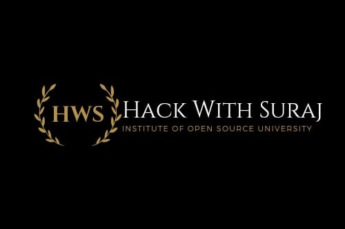

<h3>Hack With Suraj Institute of Open Source University</h3>

# Contents

- [Summary](#summary)

# Summary
Welcome to Hack With Suraj Institute of Open Source University

Hello everyone,

I am Suraj Yadav, a professional software engineer with five years of experience and the founder of this university. Despite being a 10th-grade dropout, I embarked on a journey to become a computer scientist through self-directed learning. I have navigated this unconventional path with determination and resilience, transforming my passion for technology into a successful career.

At Hack With Suraj Institute of Open Source University, I am committed to sharing my entire self-learning journey with you. I will provide access to all the content, tools, and resources that I utilized to achieve my goals. My aim is to empower and inspire you to forge your own path in the world of technology, regardless of traditional educational backgrounds.

Join me as I share the lessons from my failures and successes, and guide you through the steps that led me to where I am today. Together, we will explore the vast possibilities of self-directed learning and open-source technology, paving the way for your success in the field of computer science.

**Organization**. The curriculum is designed as follows:
- *Foundational Knowledge*: To help students understand about CSE and understand the basics of the field of CSE and create dual level projects and understand how the software industry works.
<!-- - *Basic of CSE*: To understand the real requirement of Mathematics and Physics to become a Computer Scientist and to get the first stop in the journey of becoming a Computer Scientist by self-learning path. -->

**Cost** At HSIOSU, we believe in making education accessible to all. While some courses may incur costs for graded assignments or projects, we encourage students to decide how much or how little to spend based on their own time and budget constraints. Remember, success cannot simply be purchased – dedication, effort, and perseverance are the true currencies of achievement in your educational journey.

Thank you for choosing Hack With Suraj Institute of Open Source University. We look forward to embarking on this educational journey with you!

# Curriculum

- [Prerequisites](https://github.com/Hack-With-Suraj/Hack-With-Suraj-Institute-of-Open-Source-University?tab=readme-ov-file#prerequisites)
- [1. Foundational Knowledge ](https://github.com/Hack-With-Suraj/Hack-With-Suraj-Institute-of-Open-Source-University?tab=readme-ov-file#1-foundational-knowledge)
  - [1. Foundational Knowledge Part 1 ](https://github.com/Hack-With-Suraj/Hack-With-Suraj-Institute-of-Open-Source-University?tab=readme-ov-file#1-foundational-knowledge-part-1)
  - [2. Foundational Knowledge Part 2 ](https://github.com/Hack-With-Suraj/Hack-With-Suraj-Institute-of-Open-Source-University?tab=readme-ov-file#2-foundational-knowledge-part-2)
<!-- - [2. Basic of CSE  ](https://github.com/Hack-With-Suraj/Hack-With-Suraj-Institute-of-Open-Source-University?tab=readme-ov-file#2-basic-of-cse)
  - [1. Basic of CSE Part 1 ](https://github.com/Hack-With-Suraj/Hack-With-Suraj-Institute-of-Open-Source-University?tab=readme-ov-file#1-basic-of-cse-part-1)
  - [2. Basic of CSE Part 2 ](https://github.com/Hack-With-Suraj/Hack-With-Suraj-Institute-of-Open-Source-University?tab=readme-ov-file#2-basic-of-cse-part-2)  -->

 

---

## Prerequisites

- [Future Education ](https://github.com/Hack-With-Suraj/Hack-With-Suraj-Institute-of-Open-Source-University?tab=readme-ov-file#1-basic-of-cse)
 assumes the student has already taken  [ College Algebra ](https://www.khanacademy.org/math/college-algebra) And if the student has not done College Algebra then [ Click here ](https://www.khanacademy.org/math/college-algebra) and complete College Algebra by Khan Academy otherwise you can do College Algebra through other platforms like [ edX ](https://edx.org/), [ Coursera ](https://www.coursera.org/) and [ YouTube ](https://www.youtube.com/).

## 1. Foundational Knowledge 

### 1. Foundational Knowledge Part 1

**Topics covered**:
`To help students understand about CSE and understand the basics of the field of CSE and create dual level projects and understand how the software industry works.`

#### 1. Front-End Devlopment

**Topics covered**:
`Web Design`
`Web Accessibility`
`Html5`
`Web Development`
`Style Sheets`
`Cascading Style Sheets (CSS)`
`js`
`Test-Driven Development`
`Front-End Web Development`
`Object-Oriented Programming (OOP)`
`Responsive`
`Bootstrap`
`Grid system`
`Web Development Framework`
`React (Web Framework)`
`Application development`
`Unit Testing`

Courses | Duration | Effort | Prerequisites | Discussion
:-- | :--: | :--: | :--: | :--:
[Introduction to HTML5 By University of Michigan ](https://www.coursera.org/learn/html) | 11 hours (approximately) | 3 weeks ( Try to Cover in 2 weeks ) | None | [chat](https://discord.com/channels/1252208976309784747/1252213545118994565)
[Introduction to CSS3 By University of Michigan ](https://www.coursera.org/learn/introcss) | 16 hours (approximately) | 5 weeks ( Try to Cover in 3 weeks ) | None | [chat](https://discord.com/channels/1252208976309784747/1252213794269171792)
[Programming with JavaScript By Meta ](https://www.coursera.org/learn/programming-with-javascript) | 42 hours (approximately) | - | None | [chat](https://discord.com/channels/1252208976309784747/1252213898426318899)
[Developing Websites and Front-Ends with Bootstrap By IBM ](https://www.coursera.org/learn/developing-websites-and-front-ends-with-bootstrap) | 7 hours (approximately) Try to Cover in 2 days | - | None | [chat](https://discord.com/channels/1252208976309784747/1252213954198110289)
[Git And Github ](https://www.coursera.org/learn/git-for-beginners) | 7 hours (approximately) Try to Cover in 2 days |-|  None | [chat](https://discord.com/channels/1252208976309784747/1252214006350090330)
[React Basics By Meta ](https://www.coursera.org/learn/react-basics) | 26 hours (approximately) Try to Cover in 5 days | - | None | [chat](https://discord.com/channels/1252208976309784747/1252214077519036457)
[Advanced React By Meta ](https://www.coursera.org/learn/advanced-react) | 26 hours (approximately) Try to Cover in 5 days | - | None | [chat](https://discord.com/channels/1252208976309784747/1252214132007239824)
[Designs and Prototypes in Figma By Google ](https://www.coursera.org/learn/high-fidelity-designs-prototype) | 29 hours (approximately) Try to Cover in 6 days | - | None | [chat](https://discord.com/channels/1252208976309784747/1253396698340917290)
[Cloud Native, DevOps, Agile, and NoSQL By IBM  ](https://www.coursera.org/learn/cloud-native-devops-agile-nosql) | 12 hours (approximately) Try to Cover in 3 days | - | Fundamental knowledge of web development(HTML,CSS,JS)  | [chat](https://discord.com/channels/1252208976309784747/1253397677761106025)
[Intro To Containers w/ Docker, Kubernetes & OpenShift By IBM ](https://www.coursera.org/learn/ibm-containers-docker-kubernetes-openshift) | 13 hours (approximately) Try to Cover in 4 days | - | Basic understanding of cloud and programming concepts.  | [chat](https://discord.com/channels/1252208976309784747/1253398969279840398)
[Software Developer Career Guide and Interview Preparation By IBM ](https://www.coursera.org/learn/software-developer-career-guide-and-interview-preparation) | 11 hours (approximately) Try to Cover in 2 days | - | None  | [chat](https://discord.com/channels/1252208976309784747/1253399791405371484)
[Basic Mathematics ](https://www.coursera.org/learn/basicmathematics/) | 27 hours | 3 weeks at 9 hours a week | None  | [chat](https://discord.com/channels/1252208976309784747/1262110925318783036)

<h1>Books :- </h1>
1.Eloquent JavaScript:- https://eloquentjavascript.net/Eloquent_JavaScript_small.pdf  
2.Pro Git:- https://progit2.s3.amazonaws.com/en/2016-03-22-f3531/progit-en.1084.pdf 
3. Fullstack React:- https://demo.smarttrainerlms.com/uploads/0003/trainings/course/45/modules/fullstack-react-book-r30_1510302324482009603.pdf  

<!-- 
#### 2. Back-End Devlopment

**Topics covered**:

Courses | Duration | Effort | Prerequisites | Discussion
:-- | :--: | :--: | :--: | :--:
[Back-End Developer Professional by Meta](https://www.coursera.org/professional-certificates/meta-back-end-developer) | 5 months  | 14 hours a week | None | [chat](https://discord.gg/syA242Z)

## 2. Foundational Knowledge Part 2

**Topics covered**:
`Introduction to Programming (python)`
`Calculus and Linear Algebra`
`Mechanics, thermodynamics, waves`
`Basic Electronics`
`Communication Skills`

#### 1. Introduction to Programming (python)

**Topics covered**:
`Json`
`Xml`
`Database (DBMS)`
`Simple Algorithm`
`Python Programming`
`Problem Solving`
`Computation`

Courses | Duration | Effort | Prerequisites | Discussion
:-- | :--: | :--: | :--: | :--:
[Python for Everybody Specialization By Charles Russell Severance](https://www.coursera.org/specializations/python) | 2 months | 10 hours a week | None | [chat](https://discord.gg/syA242Z)
[Computational Thinking for Problem Solving By Susan Davidson](https://www.coursera.org/learn/computational-thinking-problem-solving) | 3 weeks |  6 hours a week | None | [chat](https://discord.gg/syA242Z)

#### 2. Mathematics I : Calculus and Linear Algebra

**Topics covered**:
`logic`
`Mathematics`
`Calculus`
`Matrix Analysis`

Courses | Duration | Effort | Prerequisites | Discussion
:-- | :--: | :--: | :--: | :--:
[Introduction to Calculus By the university of Sydney](https://www.coursera.org/learn/introduction-to-calculus) | 3 weeks | 19 hours a week | none | [chat](https://discord.gg/syA242Z)
[Linear Algebra from Elementary to Advanced Specialization By Johns Hopkins University ](https://www.coursera.org/specializations/linear-algebra-elementary-to-advanced) | 1 month | 10 hours a week | [Completion of College Algebra](https://www.khanacademy.org/math/college-algebra) | [chat](https://discord.gg/syA242Z)

#### 2. Physics for Engineers I

**Topics covered**:
`Mechanics`
`thermodynamics`
`waves`

Courses | Duration | Effort | Prerequisites | Discussion
:-- | :--: | :--: | :--: | :--:
[Introduction to Mechanics Specialization By Rice University ](https://www.coursera.org/specializations/introduction-to-mechanics) | 2 months | 10 hours a week | good understanding of algebra, geometry, and trigonometry | [chat](https://discord.gg/syA242Z)
[Energy and Thermodynamics By Harvard University ](https://www.classcentral.com/course/chemistry-harvard-university-energy-and-thermodyn-61435) | 10 week | 4-8 hours a week | None | [chat](https://discord.gg/syA242Z)
[Waves By Dr Juan Klopper ](https://www.classcentral.com/course/youtube-physics-waves-90893) | 11 hours| - | None | [chat](https://discord.gg/syA242Z)

#### 3. Communication Skills

**Topics covered**:
`Oral Communication for Engineering Leaders`
`Interpersonal Communication for Engineering Leaders`
`Writing Skills for Engineering Leaders`

Courses | Duration | Effort | Prerequisites | Discussion
:-- | :--: | :--: | :--: | :--:
[Communication Skills for Engineers Specialization By Rice University ](https://www.coursera.org/specializations/leadership-communication-engineers#courses) | 2 month | 10 hours a week | None | [chat](https://discord.gg/syA242Z)

## 2. Basic of CSE 

### 1. Basic of CSE Part 1

**Topics covered**:
`Introduction to Programming (python)`
`Calculus and Linear Algebra`
`Mechanics, thermodynamics, waves`
`Basic Electronics`
`Communication Skills`

#### 1. Introduction to Programming (python)

**Topics covered**:
`Json`
`Xml`
`Database (DBMS)`
`Simple Algorithm`
`Python Programming`
`Problem Solving`
`Computation`

Courses | Duration | Effort | Prerequisites | Discussion
:-- | :--: | :--: | :--: | :--:
[Python for Everybody Specialization By Charles Russell Severance](https://www.coursera.org/specializations/python) | 2 months | 10 hours a week | None | [chat](https://discord.gg/syA242Z)
[Computational Thinking for Problem Solving By Susan Davidson](https://www.coursera.org/learn/computational-thinking-problem-solving) | 3 weeks |  6 hours a week | None | [chat](https://discord.gg/syA242Z)

#### 2. Mathematics I : Calculus and Linear Algebra

**Topics covered**:
`logic`
`Mathematics`
`Calculus`
`Matrix Analysis`

Courses | Duration | Effort | Prerequisites | Discussion
:-- | :--: | :--: | :--: | :--:
[Introduction to Calculus By the university of Sydney](https://www.coursera.org/learn/introduction-to-calculus) | 3 weeks | 19 hours a week | none | [chat](https://discord.gg/syA242Z)
[Linear Algebra from Elementary to Advanced Specialization By Johns Hopkins University ](https://www.coursera.org/specializations/linear-algebra-elementary-to-advanced) | 1 month | 10 hours a week | [Completion of College Algebra](https://www.khanacademy.org/math/college-algebra) | [chat](https://discord.gg/syA242Z)

#### 2. Physics for Engineers I

**Topics covered**:
`Mechanics`
`thermodynamics`
`waves`

Courses | Duration | Effort | Prerequisites | Discussion
:-- | :--: | :--: | :--: | :--:
[Introduction to Mechanics Specialization By Rice University ](https://www.coursera.org/specializations/introduction-to-mechanics) | 2 months | 10 hours a week | good understanding of algebra, geometry, and trigonometry | [chat](https://discord.gg/syA242Z)
[Energy and Thermodynamics By Harvard University ](https://www.classcentral.com/course/chemistry-harvard-university-energy-and-thermodyn-61435) | 10 week | 4-8 hours a week | None | [chat](https://discord.gg/syA242Z)
[Waves By Dr Juan Klopper ](https://www.classcentral.com/course/youtube-physics-waves-90893) | 11 hours| - | None | [chat](https://discord.gg/syA242Z)

#### 3. Communication Skills

**Topics covered**:
`Oral Communication for Engineering Leaders`
`Interpersonal Communication for Engineering Leaders`
`Writing Skills for Engineering Leaders`

Courses | Duration | Effort | Prerequisites | Discussion
:-- | :--: | :--: | :--: | :--:
[Communication Skills for Engineers Specialization By Rice University ](https://www.coursera.org/specializations/leadership-communication-engineers#courses) | 2 month | 10 hours a week | None | [chat](https://discord.gg/syA242Z)

### 2. Basic of CSE Part 2

**Topics covered**:
`Introduction to Programming (python)`
`Calculus and Linear Algebra`
`Mechanics, thermodynamics, waves`
`Basic Electronics`
`Communication Skills`

#### 1. Introduction to Programming (python)

**Topics covered**:
`Json`
`Xml`
`Database (DBMS)`
`Simple Algorithm`
`Python Programming`
`Problem Solving`
`Computation`

Courses | Duration | Effort | Prerequisites | Discussion
:-- | :--: | :--: | :--: | :--:
[Python for Everybody Specialization By Charles Russell Severance](https://www.coursera.org/specializations/python) | 2 months | 10 hours a week | None | [chat](https://discord.gg/syA242Z)
[Computational Thinking for Problem Solving By Susan Davidson](https://www.coursera.org/learn/computational-thinking-problem-solving) | 3 weeks |  6 hours a week | None | [chat](https://discord.gg/syA242Z)

#### 2. Mathematics I : Calculus and Linear Algebra

**Topics covered**:
`logic`
`Mathematics`
`Calculus`
`Matrix Analysis`

Courses | Duration | Effort | Prerequisites | Discussion
:-- | :--: | :--: | :--: | :--:
[Introduction to Calculus By the university of Sydney](https://www.coursera.org/learn/introduction-to-calculus) | 3 weeks | 19 hours a week | none | [chat](https://discord.gg/syA242Z)
[Linear Algebra from Elementary to Advanced Specialization By Johns Hopkins University ](https://www.coursera.org/specializations/linear-algebra-elementary-to-advanced) | 1 month | 10 hours a week | [Completion of College Algebra](https://www.khanacademy.org/math/college-algebra) | [chat](https://discord.gg/syA242Z)

#### 2. Physics for Engineers I

**Topics covered**:
`Mechanics`
`thermodynamics`
`waves`

Courses | Duration | Effort | Prerequisites | Discussion
:-- | :--: | :--: | :--: | :--:
[Introduction to Mechanics Specialization By Rice University ](https://www.coursera.org/specializations/introduction-to-mechanics) | 2 months | 10 hours a week | good understanding of algebra, geometry, and trigonometry | [chat](https://discord.gg/syA242Z)
[Energy and Thermodynamics By Harvard University ](https://www.classcentral.com/course/chemistry-harvard-university-energy-and-thermodyn-61435) | 10 week | 4-8 hours a week | None | [chat](https://discord.gg/syA242Z)
[Waves By Dr Juan Klopper ](https://www.classcentral.com/course/youtube-physics-waves-90893) | 11 hours| - | None | [chat](https://discord.gg/syA242Z)

#### 3. Communication Skills

**Topics covered**:
`Oral Communication for Engineering Leaders`
`Interpersonal Communication for Engineering Leaders`
`Writing Skills for Engineering Leaders`

Courses | Duration | Effort | Prerequisites | Discussion
:-- | :--: | :--: | :--: | :--:
[Communication Skills for Engineers Specialization By Rice University ](https://www.coursera.org/specializations/leadership-communication-engineers#courses) | 2 month | 10 hours a week | None | [chat](https://discord.gg/syA242Z)
 -->
